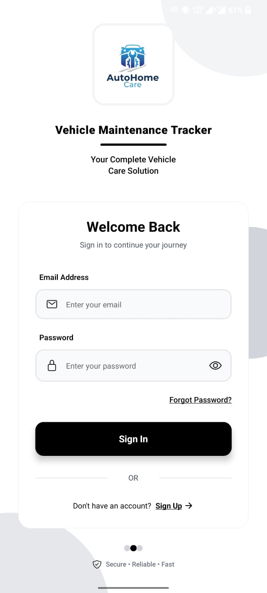
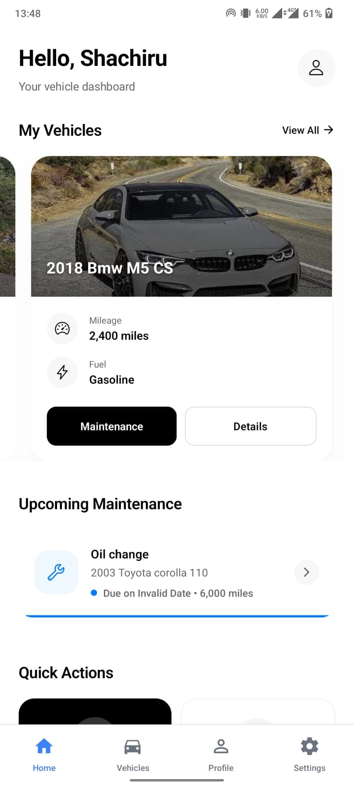
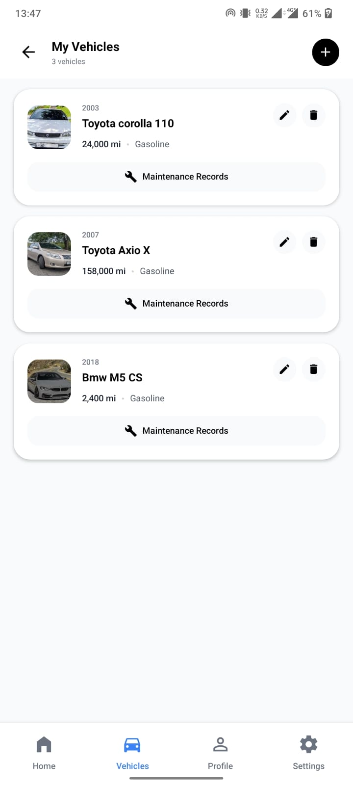

# Home Vehicle Maintenance Tracker

## AutoHome Care App


## 📋 Overview

Home Vehicle Maintenance Tracker is a mobile application designed to help vehicle owners keep track of their maintenance schedules, repair history, and vehicle information. Built with React Native and Firebase, this app provides an intuitive interface to record, track, and receive reminders for important maintenance tasks, all accessible from your mobile device.

## ✨ Features

- **User Authentication**: Secure login and registration using Firebase Authentication
- **Multiple Vehicle Management**: Add and manage all your vehicles in one place
- **Maintenance Logging**: Record oil changes, tire rotations, brake replacements, and more
- **Service Reminders**: Get notifications for upcoming or overdue maintenance tasks
- **Expense Tracking**: Keep track of all maintenance costs and view spending summaries
- **Mileage Logging**: Record mileage for maintenance scheduling and fuel efficiency monitoring
- **Service History**: Access your complete maintenance history for each vehicle
- **Document Storage**: Save photos of receipts, warranties, and vehicle documents
- **Offline Capability**: Use core features even without an internet connection

## 🛠️ Tech Stack

### Frontend
- **Framework**: [React Native](https://reactnative.dev/) for cross-platform mobile development
- **Language**: [TypeScript](https://www.typescriptlang.org/) for type-safe code
- **Styling**: [Tailwind CSS](https://tailwindcss.com/) with [TailwindCSS-React-Native](https://github.com/marklawlor/tailwindcss-react-native)
- **Navigation**: [React Navigation](https://reactnavigation.org/) for screen management
- **State Management**: [React Context API](https://reactjs.org/docs/context.html) with hooks
- **Forms**: [React Hook Form](https://react-hook-form.com/) for efficient form handling

### Backend & Services
- **Authentication**: [Firebase Authentication](https://firebase.google.com/products/auth) for user management
- **Database**: [Cloud Firestore](https://firebase.google.com/products/firestore) for real-time data storage
- **Storage**: [Firebase Storage](https://firebase.google.com/products/storage) for document and image storage
- **Notifications**: [Firebase Cloud Messaging](https://firebase.google.com/products/cloud-messaging) for reminders
- **Analytics**: [Firebase Analytics](https://firebase.google.com/products/analytics) for usage insights

### Development Tools
- **Package Manager**: [npm](https://www.npmjs.com/) or [Yarn](https://yarnpkg.com/)
- **Build Tool**: [Expo](https://expo.dev/) for simplified development and deployment
- **Version Control**: Git with GitHub
- **Linting & Formatting**: [ESLint](https://eslint.org/) and [Prettier](https://prettier.io/)
- **Testing**: [Jest](https://jestjs.io/) for unit testing

## 📱 Screenshots

<div align="center">
  
  
  
</div>

## 📥 Installation

### Direct Download
Download the APK directly to your Android device:
- [Download APK](https://expo.dev/artifacts/eas/nXNbzhP15fZvyQuCQwqs3.apk)

### Prerequisites
- Node.js (v14.x or higher)
- npm or Yarn
- Expo CLI (`npm install -g expo-cli`)
- Firebase account

### Setup Instructions

1. **Clone the repository**
   ```bash
   git clone https://github.com/Shachiru/Home-Vehicle-Maintenance-Tracker.git
   cd Home-Vehicle-Maintenance-Tracker
   ```

2. **Install dependencies**
   ```bash
   npm install
   # or
   yarn install
   ```

3. **Firebase Configuration**
   - Create a new Firebase project at [Firebase Console](https://console.firebase.google.com/)
   - Enable Authentication, Firestore, and Storage services
   - Get your Firebase configuration (apiKey, authDomain, etc.)
   - Create a `.env` file in the project root with your Firebase config:
     ```
     FIREBASE_API_KEY=your_api_key
     FIREBASE_AUTH_DOMAIN=your_auth_domain
     FIREBASE_PROJECT_ID=your_project_id
     FIREBASE_STORAGE_BUCKET=your_storage_bucket
     FIREBASE_MESSAGING_SENDER_ID=your_messaging_sender_id
     FIREBASE_APP_ID=your_app_id
     ```

4. **Start the development server**
   ```bash
   expo start
   # or
   npm start
   # or
   yarn start
   ```

5. **Run on a device or emulator**
   - Scan the QR code with the Expo Go app on your Android/iOS device
   - Press 'a' for Android emulator or 'i' for iOS simulator in the terminal

## 🖥️ Usage Guide

### Getting Started
1. **Create an Account**: Sign up using email/password or Google account
2. **Add a Vehicle**: Tap "+" to add your vehicle with make, model, year, and additional details
3. **Set Up Maintenance Tasks**: Configure recommended maintenance items for your vehicle

### Daily Use
1. **Log Maintenance**: Record service tasks with date, mileage, cost, and notes
2. **View History**: See all past maintenance for each vehicle
3. **Check Reminders**: Review upcoming or overdue maintenance tasks
4. **Track Expenses**: Monitor your spending on vehicle maintenance

### Advanced Features
1. **Export Data**: Generate and share maintenance reports
2. **Backup**: Sync data across devices with your Firebase account
3. **Documents**: Store vehicle manuals, insurance papers, and registration documents

## 🚀 Roadmap

- [ ] Barcode/VIN scanner for quick vehicle information entry
- [ ] Fuel economy tracking and analysis
- [ ] Integration with OBD-II adapters for diagnostic data
- [ ] Dark mode and additional themes
- [ ] Offline-first architecture for improved performance
- [ ] Multiple language support

## 🤝 Contributing

Contributions are welcome! Please feel free to submit a Pull Request.

1. Fork the repository
2. Create your feature branch (`git checkout -b feature/amazing-feature`)
3. Commit your changes (`git commit -m 'Add some amazing feature'`)
4. Push to the branch (`git push origin feature/amazing-feature`)
5. Open a Pull Request

## 📄 License

This project is licensed under the MIT License - see the [LICENSE](LICENSE) file for details.

## 📞 Contact

Shachiru - [GitHub Profile](https://github.com/Shachiru)

Project Link: [https://github.com/Shachiru/Home-Vehicle-Maintenance-Tracker](https://github.com/Shachiru/Home-Vehicle-Maintenance-Tracker)
